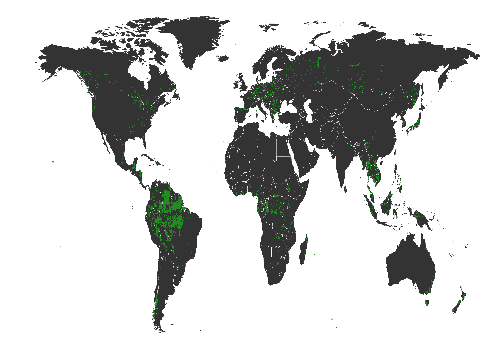
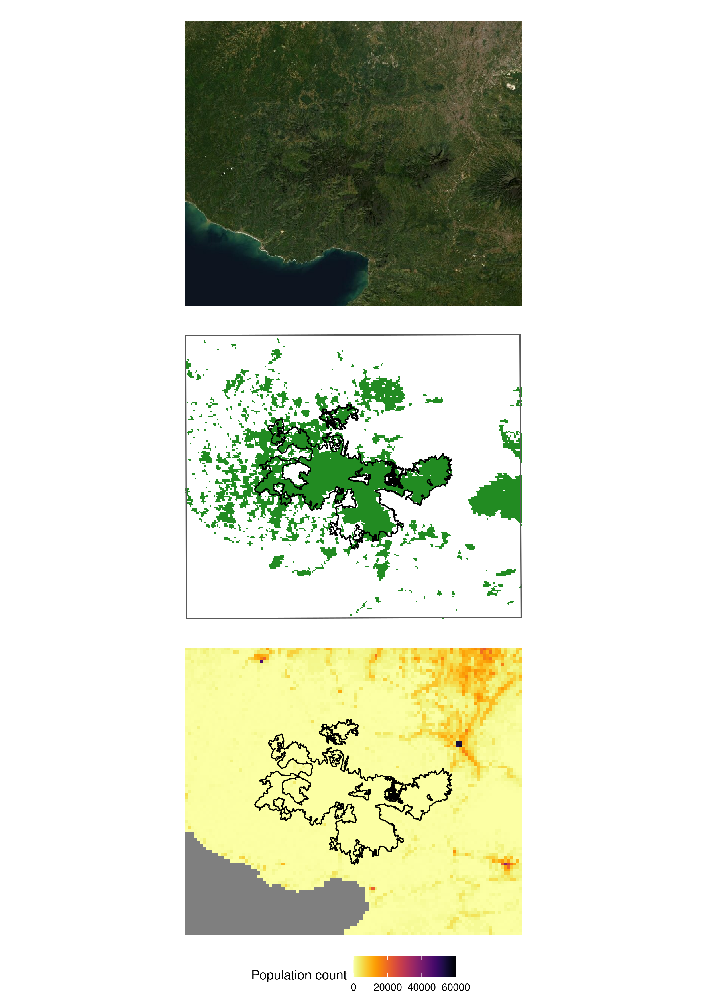
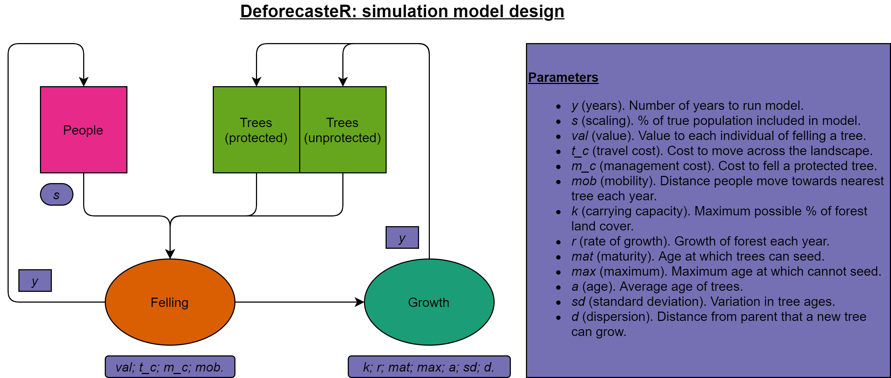
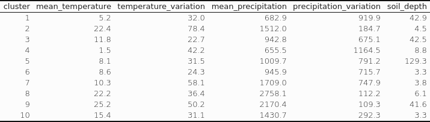
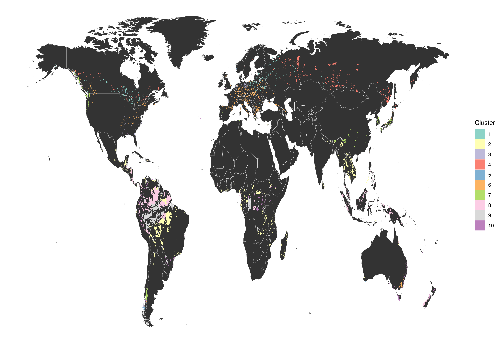
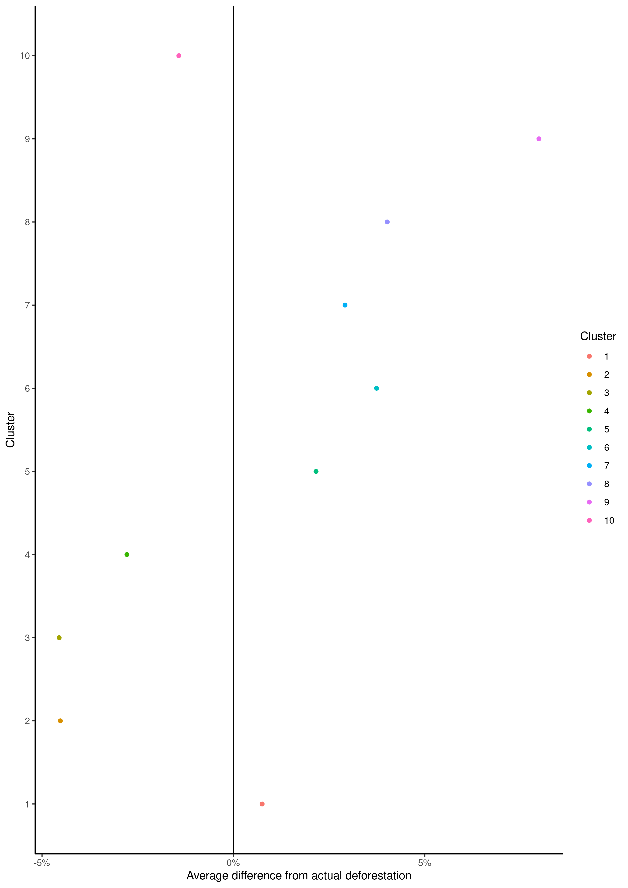
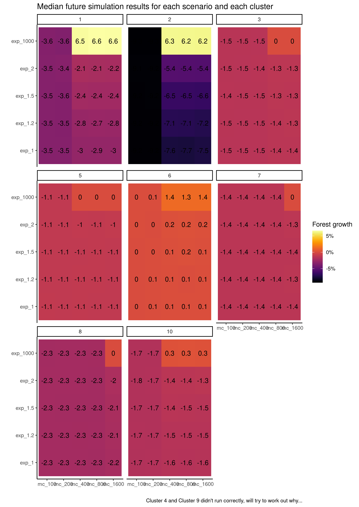
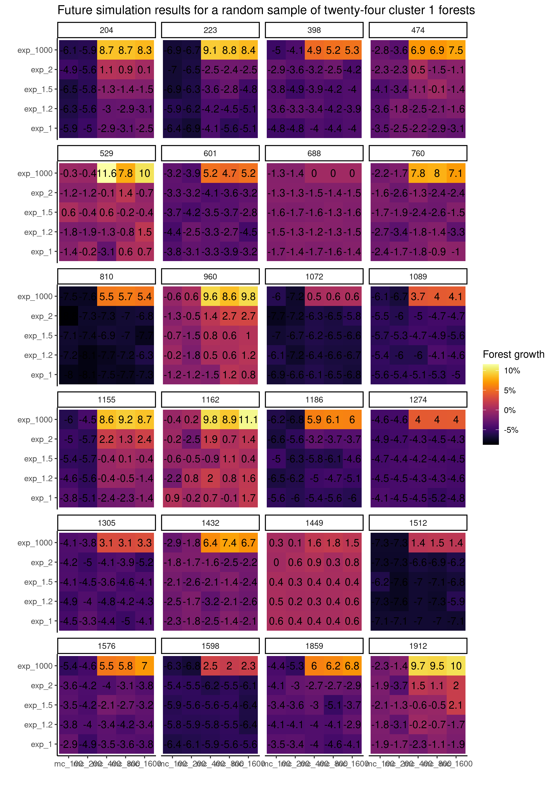

<style>
p.caption {
  font-size: 2em;
}
</style>


```{r setup, include=FALSE}
knitr::opts_chunk$set(echo = FALSE, fig.topcaption=TRUE)
library(knitr)

```


This has been a bit rushed since my simulations only finished this morning! But I thought I'd update with where I'm at and the next steps - it's been a productive two weeks and I'm extremely happy with the model performance, and the results look like they confirm that the COP26 commitment is unlikely (surprise). There is a lot left to decipher.

**Defining protected forests**

First step was to define the study area. The focus is policy and international climate commitments, so I selected protected areas (as opposed to all forests). The protected area dataset from the [WDPA](https://www.protectedplanet.net/en) contains polygons bounding protected areas.

To work out whether these protected areas are forested, I used MODIS satellite data [(MCD12Q1)](https://lpdaac.usgs.gov/products/mcd12q1v006/) on land cover. If the protected area was more than 50% forested, it became a forest protected area.


``` {r fpa_map, fig.cap = "Protected forest areas"}



```


My virtual forests were created by drawing a 20km buffer circle around each forest, then rectangle around that buffer. 
I used [LandScan](https://landscan.ornl.gov/) data to gather population counts within this area for each protected forest.

So, one example is Gunung Halimun - Salak, a national park just south of Jakarta in Indonesia.
(I can create a similar example map for any of the forests just by changing the id...) This could be presented better, but it shows the layering of different data for the same area.


``` {r virtualreality, fig.cap = "Virtual representation of Gunung Halimun - Salak"}




```

These virtual forests - particularly the location of people, the location of protected trees, and the location of unprotected trees, are fed into the simulation model.

**Developing an agent-based deforestation simulation model**

The model was coded in R and C++. To begin, virtual forests and populations (scaled down by a fixed percentage) are fed in as the starting point. Then, people decide whether to chop down trees (based on how far away they are, the cost to move across the landscape, and the perceived value of a tree). Then forests grow (based on the carrying capacity of the land, the rate of growth, and the forest age profile).

``` {r schematic, fig.cap = "Model outline"}



```

**Grouping similar forests together with a cluster analysis**

Each forest will have different characteristics. It should be the case that forests with similar climate/soil characteristics will grow at a similar rate. So I grouped forests using a cluster analysis (kmeans) into 10 discrete groups using temperature (average and variation), rainfall (average and variation) and soil depth. It would be possible to group into as many or as few categories as possible. The intention was to get specific enough that the model was appropriately calibrated, but general enough that the results are interpretable.


``` {r clustertable, fig.cap = "Average biophysical attributes of forests by cluster", out.width = "100%"}



```


And this seems to work pretty well. Here is the world map again, but this time with clusters drawn onto it...


``` {r clustermap, fig.cap = "Protected forest area locations by cluster"}



```

**Calibrating model parameters to each specific forest type**

This was the hard bit. I knew what happended to land cover between 2000 and 2020 using the MODIS time series data. I wanted to emulate this as closely as possible by varying the parameters that went into the simulation model for each cluster. There were 11 continuous paramters, so an exhaustive search would have taken 13 years by my last calculation. So I had to use an ML algorithm tuning shortcut.  

So for each cluster, I used 90% of the forests in that cluster to train the model - what configuration of parameters gave the closest deforestation rate to the actual deforestation rate. This used irace, a machine learning parameter tuning tool - recommended by Sandy Brownlee.

I then tested how well the trained model performed on 10% of forests which it hadn't seen. It did really well! Which is fantastic, and justifies the results / analysis / aiming high with journals. It didn't systematically over or underestimate deforestation, and the average deviation from actual deforestaion was small in all (apart from cluster 9).


``` {r modelperformance, fig.cap = "Model performance by cluster"}



```

**Running simulations into the future to assess the COP commitment**

The last step was to use the model parameters from the calibration stage to run simulations into the future. I wanted to test two options - whether increasing the number of protected trees made a difference, and whether increasing the penalty for chopping down a protected tree made a difference·

So I tried 25 scenarios - increasing the number of protected trees by 0%, 20%, 50%, 100% or all trees; and setting a penalty for chopping down trees at 100 (the value used in calibration), 200, 400,800 and 1600.

Here are the results in a heatmap by cluster... This gets the mean deforestation rate for each forest, and reports it by cluster for each of the 25 scenarios. I haven't yet worked out the best way of visualising this data, but here is a start. Clusters 9 and 4 didn't run properly (no idea why), and the whole lot took from Sunday afternoon to Friday morning. Next time I run this (imagine I'll need to redo the analysis when I've had feedback) I'll need to think of a better way of speeding this up.

``` {r  futureresults_cluster, fig.cap = "Simulation results - forest growth in 2032 by scenarios amd cluster"}



```

And here are a random sample of 25 forests from cluster 1, to show that it is working differently in different forests.

``` {r futureresults_forests, fig.cap = "Simulation results - forest growth in 25 random forests for illustration"}



```

I think the things that immediately struck me were: 

1) Both expanding the areas and making it more robust was always necessary.
2) Cluster 2 is worrying (rainforests bordering population).
3) Ending deforestation is only feasible given a very very significant increase from the status quo.
4) Lots of forests are predicted to grow. It would be good to try to understand which are not predicted to

**Next steps**

1) Write up results into article (2/3 days now the results are in)
2) Get feedback (meeting with everyone in August to discuss)
3) Rerun analysis with changes for the better
4) Rewrite article
5) Publish! 
